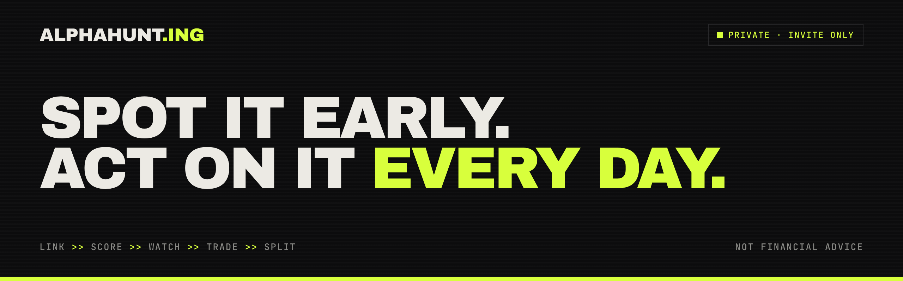

<p align="center">
  
</p>

<p align="center">
  
  
  
  
  
  
  
  
</p>

<p align="center">
  <b>alphahunt.ing</b> · a <a href="https://factory0.ventures">Factory Zero</a> venture · <a href="https://github.com/Alphahunt-ing">github.com/Alphahunt-ing</a>
</p>

---

# The site

The site for **AlphaHunt**, a private, invite-only crypto intel circle.
Members post links; each gets a scored verdict (act, watch or skip), every
idea and trade is logged, members keep their own keys and sign every trade,
and contributors share in the profit made on their calls. One page, one
stylesheet and one small script, served by Cloudflare as static assets. No
framework, no bundler, no build step and no runtime dependency.

It was designed in Claude Design (`alphahunt-site.dc.html`, a static template
with inline styles and no behaviour) and ported to static HTML: the same
layout, type (Archivo Black, Geist, JetBrains Mono), palette, scanline
background and blink animation. The design has no photo slots, so there are
no generated stills.

## The rules this site is built around

AlphaHunt is a crypto trading circle with profit sharing. Copy about money
is where a site like this gets into trouble, so:

- **NOT FINANCIAL ADVICE** stays visible: in the footer, in `llms.txt` and on
  the Open Graph card.
- **Examples say they are examples.** The $5,000 → $1,000 rewards card carries
  `[ EXAMPLE ]`, the timeline is `[ EXAMPLE · ONE IDEA, START TO FINISH ]`, and
  the $EXMPL inbox card is labelled `EXAMPLE · LINK INBOX`.
- **The TVL figures carry their source and date:** DefiLlama, Sep 2026.
- **Invent nothing.** No returns, member counts, win rates, testimonials or
  performance. The circle is in Phase 1 (build and backtest) and has published
  none; the page says so in its roadmap.
- **No sign-up form.** The circle is invite-only ("invites come from
  members"). There is no waitlist and no form; the only contact is
  `contact@alphahunt.ing`.
- Five lines are **flagged for legal review before launch** (the 20% profit
  share, on-chain profit shares, "real money on every signal, results public",
  the auto-sell description and the "life-changing money" line). See
  [`COPY.md`](COPY.md).

## The page

| Anchor | Section | Job |
| :--- | :--- | :--- |
| `#top` | Hero | "Spot it early. Act on it every day.", the pitch, and the spec: verdict, coverage, your share (20%) |
| `#vision` | Vision | "A private edge": two-person partnership to a small invite-only circle, and the five principles |
| `#system` | The System | Input, Claude, Grok agents, verdict; the three outcomes; the $EXMPL inbox card and its six-point checklist (an example) |
| `#app` | The App | The five tabs, Honcho memory, and one idea start to finish (an example) |
| `#strategy` | The Strategy | Community coin rotation, the 30-day range bar, the rotation rules, the sell-signals panel |
| `#rewards` | Contributor Rewards | Post, members use it, they profit, 20% to you; the $5,000 → $1,000 example card |
| `#safety` | Wallet Safety | No pooled money, three safety rules, and the vault / trading / burner tiers |
| `#chains` | Chains + Data | DeFi TVL by chain (DefiLlama, Sep 2026) and the auto-scanned sources |
| `#rules` | Rules + Roadmap | Six rules and the four phases, Phase 1 now |
| (footer) | Footer | The lime wordmark, members only, invites from members, **not financial advice** |

Plus `404.html` (a "SKIP" verdict on a missing page), `llms.txt`,
`sitemap.xml`, `robots.txt`, `site.webmanifest`, `.well-known/security.txt` and
an Open Graph card.

## How it behaves

The page needs no script. The one behaviour, the compact menu below 1080px
(the nav has seven items), is a `<details>` element, so it opens and closes with
JavaScript blocked. `assets/alphahunt.js` only closes it after a link is chosen,
on Escape, on an outside click, and when the window widens. With
`prefers-reduced-motion` the blinking squares hold still and anchor scrolling
jumps instead of gliding. No horizontal scroll at 390px: the wrapper uses
`overflow-x: clip` (not `hidden`, which would break the sticky nav). The CSP
allows no inline script or style, so nothing on the page uses either.

## Layout

```
.
├── index.html                  the page
├── 404.html
├── assets/
│   ├── alphahunt.css           the whole design system, tokens at the top
│   ├── alphahunt.js            closes the compact menu; nothing else
│   ├── favicon.svg             the mark: a lime "A" on #0C0C0D
│   ├── og.png                  Open Graph card
│   ├── apple-touch-icon.png  icon-512.png
│   ├── org-avatar.png          GitHub organization avatar, uploaded by hand
│   └── readme-banner.png       the banner above
├── tools/
│   ├── build-dist.sh           assembles dist/ from an allowlist, stamps cache hashes
│   ├── deploy.sh               deploys main (origin/main once there is a remote), nothing else
│   ├── og-render.html          source for og.png
│   ├── banner-render.html      source for the README banner
│   ├── avatar-render.html      source for the org avatar
│   └── render-og.sh            renders all of the above with headless Chrome
├── llms.txt  robots.txt  sitemap.xml  site.webmanifest  _headers  _redirects
├── .well-known/security.txt
├── wrangler.toml
└── COPY.md                     every claim, with its source and review flags
```

## Local preview

No build step, but the page uses root-relative paths, so serve it rather than
opening it as `file://`:

```sh
python3 -m http.server 8080
# then http://localhost:8080/
```

## Regenerating images

```sh
./tools/render-og.sh
```

It writes `og.png`, `readme-banner.png`, `org-avatar.png`, `icon-512.png` and
`apple-touch-icon.png` (the last two from `assets/favicon.svg`). Copy the
banner, avatar and icon to `Alphahunt-ing/.github` afterwards (as
`assets/banner-alphahunt.png`, `assets/org-avatar.png` and `assets/logo.png`).
GitHub has no API for organization avatars, so upload `assets/org-avatar.png`
by hand at `github.com/organizations/Alphahunt-ing/settings/profile`.

## Deploy

A Cloudflare Worker with static assets, `alphahunt-website` (`wrangler.toml`),
on the Factory0 account. It has no script: Cloudflare serves `dist/` and
applies `_headers` and `_redirects`. It is live on `alphahunt.ing` and
`www.alphahunt.ing` (custom domains the deploy attaches itself) and on its
`workers.dev` address. Commit to `main`, then:

```sh
tools/deploy.sh              # deploy main
tools/deploy.sh --dry-run    # build it and say what would ship
```

The script deploys **`origin/main` and nothing else** (it fetches first). It checks
that commit out into a throwaway worktree, builds there, deploys that, and
removes it; the deployment records the commit. It never reads your working
copy or its `dist/`. More than one agent session can work in one checkout at
once, and deploying from a working copy can publish another session's
uncommitted edits or roll back work merged minutes earlier. Do not run
`wrangler deploy` by hand.

Edit in a worktree of your own, not in the shared checkout:

```sh
git worktree add ../alphahunt-website-worktrees/<name> -b <branch> main
```

### Custom domains

`alphahunt.ing` and `www.alphahunt.ing` are routes in `wrangler.toml` with
`custom_domain = true`, on the `alphahunt.ing` zone of the Factory0 account.
`tools/deploy.sh` attaches them: Cloudflare creates the DNS records and the
certificates itself, so do not add them by hand.

### Indexing

Like the other venture sites, this one is indexable: `robots.txt` allows every
crawler (AI crawlers included), there is a sitemap and an `llms.txt`, and the
page has `index, follow`. If the circle would rather stay unlisted, switch it
to `noindex`: set the page's `<meta name="robots">` to `noindex, nofollow`,
add `X-Robots-Tag: noindex` under `/*` in `_headers`, and remove `sitemap.xml`
(from the repo and from `tools/build-dist.sh`) and the `Sitemap:` line in
`robots.txt`. Leave `robots.txt` allowing crawlers: a crawler that is blocked
never fetches the page, so it never sees the `noindex`, and a blocked URL can
still be listed from links elsewhere.

## Open questions

- **Indexing.** Listed or unlisted; see Indexing. It is listed today.
- **Legal review.** The flagged lines in `COPY.md` need it before launch.

## House rules for edits

1. **Invent nothing.** No returns, performance, track record, win rates,
   member counts, testimonials or screenshots of gains. When there are real,
   public results (the "Skin in the game" rule promises them), link to them;
   do not summarise them into a headline number.
2. **Not financial advice, always visible.** Keep it in the footer, in
   `llms.txt` and on the Open Graph card.
3. **Examples say so.** Every illustrative figure or token (the $EXMPL card, the
   timeline, the $5,000 → $1,000 card) carries an example label. Keep them.
4. **Data carries its source and date.** The TVL bars say "DefiLlama, Sep
   2026". Update the figures and the date together, or not at all.
5. **Flagged lines change only after legal review.** See `COPY.md`.
6. **No sign-up, no dark patterns.** Invites come from members: no waitlist,
   no form, no fake urgency, nothing gated behind an email.

---

<p align="center">
  <sub>No tracking cookies · Not financial advice</sub>
</p>
